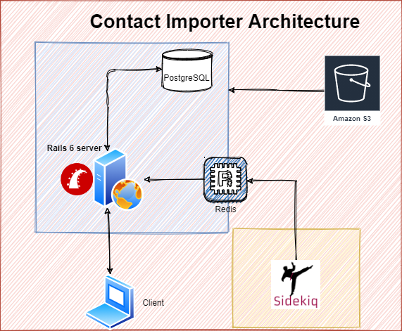

[](https://GitHub.com/Naereen/StrapDown.js/graphs/commit-activity) [](http://lbesson.bitbucket.org/) [](https://lbesson.mit-license.org/) [](https://github.com/Naereen/badges)  [](https://GitHub.com/Naereen/)
<p align="center">
  
</p>

#  Contacts Importer challenge

> **(Import & Export Contacts using .CSV files.)**

Contatcts importer challenge is a rails app that allows the user to upload and validate contacts from CSV files, to generate an unified contact file.

<p style="font-size:25px; font-weight:bold"> 

</p>
</center>

This project allows users to create an account, and start importing contacts by processing CSV files.

### Team 🎮

 [David Orejuela](https://github.com/daorejuela1) <br>  Software Developer|
| -------------- |
 
| <a href="https://twitter.com/DavidOrejuela14" ></a> &nbsp;<a href="https://www.linkedin.com/in/davidorejuela14/" ></a> <a href="https://medium.com/@daorejuela1" ></a>|

## Motivation 🏋

This software is a 1-week challenge created to test our technical knowledge using Ruby on Rails.

## Main logic 🧠

If we are not logged into the app then we can see all the most recent tweets from all the users and have the option to log in or sign up:


 1. You can sign in with the E-mail & password
 2. You can sign up to create a new account


 [Complete image to explore](https://share.balsamiq.com/c/b6PCWHSZL8PmXU3TTqoeiN.png)
 	
Once you are signed in, can import the CSV file, match the headers to know what data you want to process, see the list of imported contacts and contacts with errors, and check the state of each file that has been put throug processing.
 
## Architecture 🧠

<p align="center">
  
</p>

## Code style 👓


Rubocop ☞ [](https://github.com/rubocop/rubocop)

## Demo📷
<center>

## CSV upload & mapping
<p style="font-size:25px; font-weight:bold"> 

</p>

--------------

## Seeing the list of imported contacts & errors
<p style="font-size:25px; font-weight:bold">

</p>

--------------
## Checking the errors downloading the file
<p style="font-size:25px; font-weight:bold">

</p>

--------------
## Exporting CSV file
<p style="font-size:25px; font-weight:bold">

</p>

## Tech used 🛠


Contact Importer was created using Ruby on Rails, additionals gems used to simplify the logic were used: 

 
| Gem  | Utility |
|----------------------------------------|--|
|  Devise                                       | Simplifies user handling logic |
|  Sidekiq| Allows to easily run background process so big CSV files doesn't take down the app |
|  pagy | Simplifies loading objects into the view with a pagination logic |
 |  aws-sdk-s3| Makes it easy to connect with an Amazon S3 Bucket |
 |  credit_card_validations| To have re-usable structure to check for credit cards information |
 
## Requirements 📚

- Ubuntu 18.04+
- Ruby 2.7+
- Rails 6+
- Postgres 1.8+
- Redis 3.0+
- Sidekiq 5.4+

## Installation & Init 📖

Please make sure that you have installed the essentials and rails 6+ before cloning:

```
sudo yum install -y git-core zlib zlib-devel gcc-c++ patch readline readline-devel libyaml-devel libffi-devel openssl-devel make bzip2 autoconf automake libtool bison curl sqlite-devel redis-server
```

1. Clone the repository: `git clone https://github.com/daorejuela1/contact-importer`
2. Go to the folder: `cd contact-importer`
3. Install requirements `bundle`
4. Create the data base `rails db:create`
5. Run the migrations `rails db:migrate`
6. Start the redis-server  `redis-server`
7. Start the Sidekiq server `bundle exec sidekiq`
8. Run the server: `rails s -b 0.0.0.0 -p 3000`

## Usage 💪

Get into the URL `127.0.0.1:3000`  to start the app, and sign up with a new account to start loading contacts.

Use one of the files inside the [csv_test](csv_test/) folder to start uploading contacts or create a new csv file taking in account that the fields must have these rules
|  Key| Rule|
|--|--|
| Name  | Can contain any alphanumeric value|
| Birthday | Must be valid only (%Y%m%d) & (%Y-%m-%d) formats are accepted|
| Phone number  | Only (+00) 000-000-00-00 & (+00) 000 000 00 00 formats are accepted|
| Address| Just can't be Empty|
| Credit card| Can contain any alphanumeric value, length & issuer have to be valid|
| Email| Only accepted format [characters]@[characters].[characters]|

* All fields are mandatory
If you want to debug your CSV file, after uploading it, you can download it again from the CSV Imported files and check the added column to get the error information asociated with each contact.
## Features 📜
 
 ### CSV mapping
 

 - You can manually select which fields of your CSV file you want to process

### Import CSV file

 - You can upload your CSV file to our server for future processing

### Check contact errors

- You can check the error asocciated with importing each contact

### Export CSV file

- You can export a list with all the valid contacts in the app

### Check file state

- You can check the state of each file you want to process

### Download File Feedback

- You can download the file with an added column to analyze why the error ocurred

## Live 🧍


To check the live software clic [here](https://contact-importer-daorejuela1.herokuapp.com/) 

## Related projects 💼

Here are some awesome projects I have been working on:

|[Mastermind Hackday Project](https://github.com/daorejuela1/mastermind)| [Daily tweet](https://github.com/daorejuela1/daily_tweet) | [Monty bytecode decoder](https://github.com/daorejuela1/monty) | [Serpent Algorithm](https://github.com/daorejuela1/serpent) | [Custom Shell v2](https://github.com/daorejuela1/shell_v2)
|--|--|--|--|--|
|  |  |  |  |  |
## ToDo

 - [ ] Fix bug to implement Devise with Hotwire

## Credits ✈

Special thanks to [koombea.com](https://www.koombea.com/) for letting me be part of this awesome challenge.
